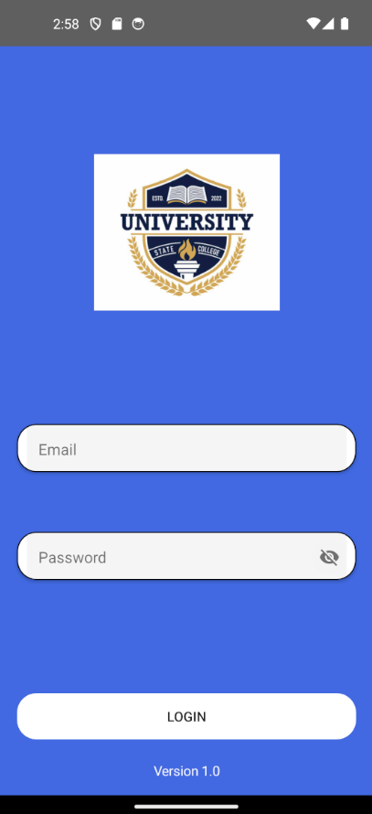
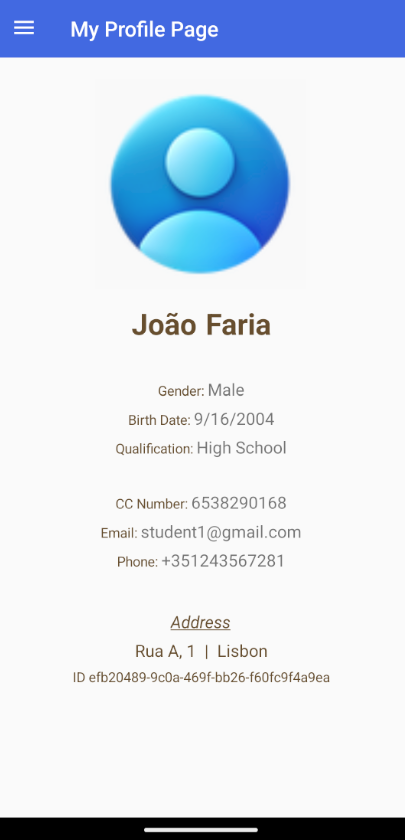
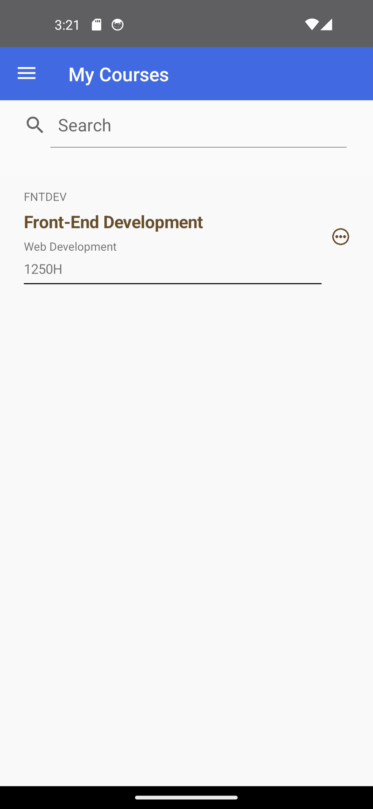
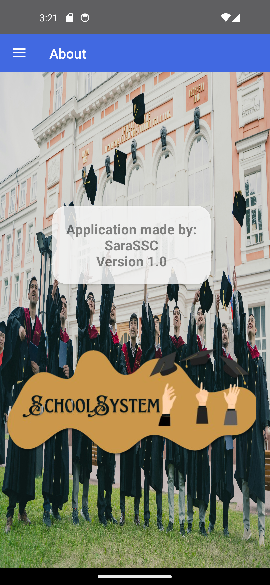

# School System #
### mobile app ###

## Information ##
This application was made to be used alongside with [SchoolSystem .AspNet MVC](https://github.com/SaraSSC/SchoolSystem) ;

The requests are made for the API in that project.

You can run both projects at the same time using a dev tunnel.

Please be sure to alter the connection string in the SchoolSystem to match your database instance if you aren't using the LocaldB;

Also, don't forget to modify the App.xaml file the ResourceDictionary to match your dev tunnel 

----------
This application has the following dependencies:
>Newtonsoft.Json Version="13.0.3"

>Syncfusion.Licensing Version="27.1.58"

>Syncfusion.Xamarin.Core Version="27.1.58"

>Xamarin.FFImageLoading Version="2.4.11.982"

>Xamarin.FFImageLoading.Forms Version="2.4.11.982"

>Xamarin.FFImageLoading.Transformations Version="2.4.11.982"

>Xamarin.Forms" Version="5.0.0.2291"

>Xamarin.Essentials.Interfaces Version="1.7.0"

>Prism.DryIoc.Forms" Version="8.1.97"

__please be aware that updating the Prism nugget package may break the application__
### App showcase ###

+ Login
  - 
+ My profile
 - 
+ My courses
  - 
+ My evaluations
  - 
+ About
  - 
